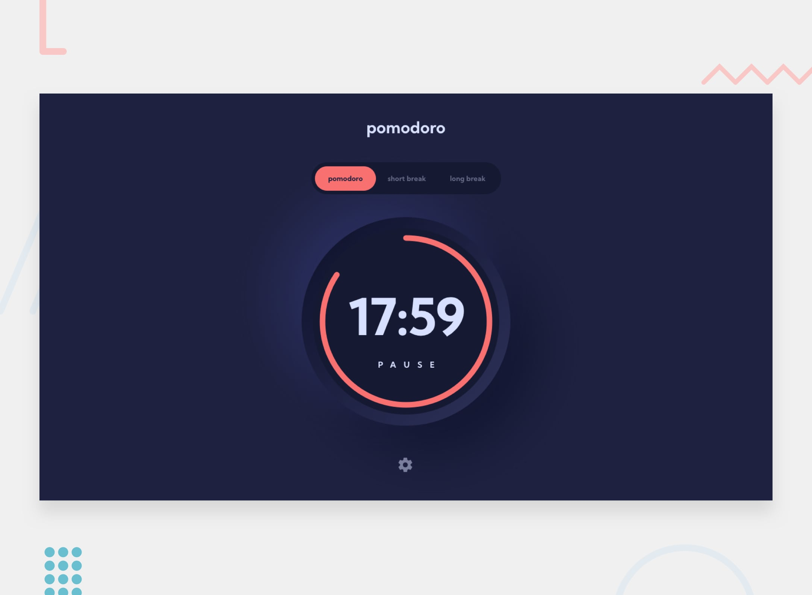

# Pomodoro

## Welcome! 👋

## The challenge

My challenge is to build out Pomodoro timer app.

Users should be able to:

- Set a pomodoro timer and short & long break timers
- Customize how long each timer runs for
- See a circular progress bar that updates every minute and represents how far through their timer they are
- Customize the appearance of the app with the ability to set preferences for fonts

### Built with

- Semantic HTML5 markup
- CSS custom properties
- Flexbox
- CSS Grid
- Mobile-first workflow
- [React](https://reactjs.org/) - JS library

## Author

- Website - [Enrica Garcia](https://www.linkedin.com/in/enrica-garcia-69541a208/)
- Frontend Mentor - [@ErriGarcia](https://www.frontendmentor.io/profile/ErriGarcia)